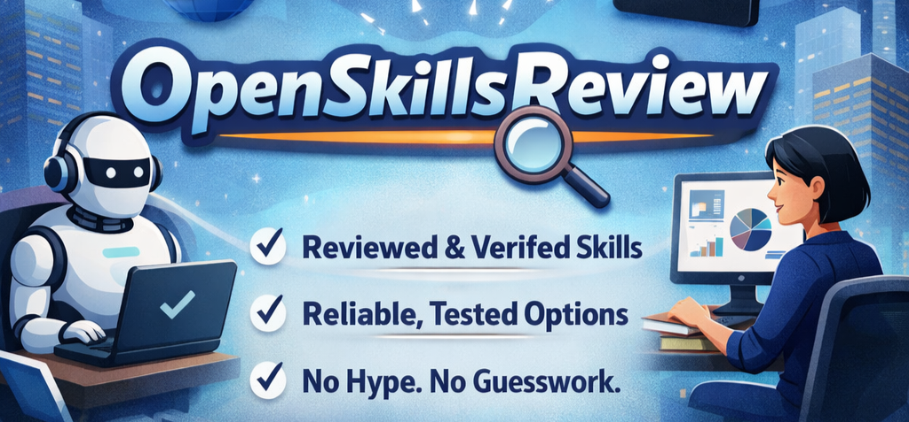

# Open Skills Review (Find Skill You Can Trust)

Create Your Own Skill: [Anthropic Skills](https://github.com/anthropics/skills) & [OpenAI Skills](https://github.com/openai/skills)

## Review Table for Skills-Source 

| Rank | Name & URL | Approx. # Skills | Review Stars | Access Methods|
| --- | --- | --- | --- | --- |
| 🥇 | [skills.sh](https://skills.sh) | **89,200+** | ⭐⭐⭐⭐☆ | Web, CLI |
| 🥈 | [clawhub.ai/skills](https://clawhub.ai/skills) | **28,304+** | ⭐⭐⭐☆☆ | Web |
| 🥉 | [Agent Skills Directory](https://www.skillsdirectory.org) | **1,036,455+** | ⭐⭐⭐☆☆ | Web |
...
| 10 | [K-Dense-AI/scientific-skills](https://github.com/K-Dense-AI/claude-scientific-skills) | **170+** | ⭐⭐⭐⭐☆ | GitHub |

Show more skills source

| Rank | Name & URL | Approx. # Skills | Review Stars | Skill Discovery Access|
| --- | --- | --- | --- | --- |
| 4 | [SkillsMP](https://skillsmp.com) | **530,778+** | ⭐⭐⭐☆☆ | Web |
| 6 | [agentskill.sh](https://agentskill.sh) | **106,000+** | ⭐⭐⭐☆☆ | Web, CLI |
| 7 | [AgentSkills](https://agentskills.to/skills) | **24,000+**  | ⭐⭐⭐☆☆ | Web |
| 8 | [LobeHub](https://lobehub.com/bg/skills) | **223,626+** | ⭐⭐⭐☆☆ | Web |
| 9 | [prompts.chat](https://prompts.chat) | **35+** | ⭐⭐⭐☆☆ | Web |
| 11 | [MCP Market](https://mcpmarket.com/tools/skills) | **62,236+** | ⭐⭐☆☆☆ | Web |
| 12 | [agent-skills.cc](https://agent-skills.cc/) | **63,000+** | ⭐⭐☆☆☆ | Web |
| 13 | [AwesomeSkill.ai](https://awesomeskill.ai) | **50,000+** | ⭐⭐☆☆☆ | Web |
| 14 | [awesomeskills.dev](https://awesomeskills.dev) | **2,287+** | ⭐⭐☆☆☆ | Web |
| 15 | [AgentSkillsHub](https://agentskillshub.dev/) | **460+** | ⭐☆☆☆☆ | Web |
| 16 | [Awesome Claude Skills](https://awesome-skills.com) | **125+** | ⭐☆☆☆☆ | Web |
| 17 | [Skill Registry](https://skillregistry.io/) | **61+** | ⭐☆☆☆☆ | Web |

## Human-verified skills

We also provide a collection of human-verified skills.
Path: `skills/<function-department>/`

### Skill for Skill-Creation

| Skill | Platform | Source | Verified(❓) |
| --- | --- | --- | --- |
| `skill-creator-claude` | `Claude Code`  | [OpenSkillsReview](skills/Skill-Creator/skill-creator-claude) | ✅ |

`skills/Skill-Creator/skill-creator-claude` is a good practice reference for skill creation and works best when combined with Claude Code.

### Skill for Skill-Search

| Skill | Platform | Source | Verified(❓) |
| --- | --- | --- | --- |
| `find-skills` | `skills.sh`  | [github.com/vercel-labs](https://github.com/vercel-labs/skills/blob/main/skills/find-skills/SKILL.md) | ✅ |
| `skill-finder` | `clawhub`  | [clawhub.ai/ivangdavila](https://clawhub.ai/ivangdavila/skill-finder) | ❓ |
| `github-search-1.0.0` | `all`  | [OpenSkillsReview](skills/Skill-Search/github-search-1.0.0) | ✅ |

Show more

| Skill | Platform | Source | Verified(❓) |
| --- | --- | --- | --- |
| `skills-search` | `skills.sh`  | [clawhub/Skills.sh Search](https://clawhub.ai/TheSethRose/skills-search) | ❓ |
| `skill-lookup` | `prompts.chat`  | [github.com/f/prompts.chat](https://github.com/f/prompts.chat/tree/main/plugins/claude/prompts.chat/skills/skill-lookup) | ❓ |

### Skill for Skill-Safe

| Skill | Platform | Source | Verified |
| --- | --- | --- | --- |
| `skill-scanner` | `openclaw, MCP`  | [github.com/bvinci1-design/skill-scanner](https://github.com/bvinci1-design/skill-scanner) | ✅ |
| `skill-review` | `openclaw, MCP`  | [OpenSkillReview](skills/Skill-Safe/skill-review) | ✅ |

### Skill for Information

| Skill | Platform | Source | Verified(❓) |
| --- | --- | --- | --- |
| `polymarket-market-data` | `OpenSkillsReview`  | [github.com/OpenSkillsReview](skills/Skill-Information/polymarket-market-data) | ✅ |
| `6551-daily-news` | `OpenSkillsReview`  | [OpenSkillsReview](skills/Skill-Information/6551-daily-news) | ✅ |

### Skill for Science

| Skill | Platform | Source | Verified(❓) |
| --- | --- | --- | --- |
| `scientific-skills` | `claude`  | [github.com/K-Dense-AI/claude-scientific-skills](https://github.com/K-Dense-AI/claude-scientific-skills) | ✅ |
| `academic-research` | `all`  | [Imbad0202](https://github.com/Imbad0202/academic-research-skills) | ✅ |
| `ClawBio` | `openclaw`  | [ClawBio](https://github.com/ClawBio/ClawBio) | ❓ |

Show more

| Skill | Platform | Source | Verified(❓) |
| --- | --- | --- | --- |
| `OpenClaw-Medical-Skills` | `all`  | [OpenClaw-Medical-Skills](https://github.com/FreedomIntelligence/OpenClaw-Medical-Skills) | ❓ |

### Skill for Dev

| Skill | Platform | Source | Verified(❓) |
| --- | --- | --- | --- |
| `minimax-ai-skills` | `Claude Code, Cursor, Windsurf, OpenCode`  | [MiniMax-AI/skills](https://github.com/MiniMax-AI/skills) | ❓ |

Intro article: https://mp.weixin.qq.com/s/i8Mm147XfD0DR41K_nQCnw

### Skill for Finance

| Skill | Platform | Source | Verified(❓) |
| --- | --- | --- | --- |
| `binance-skills-hub` | `all`  | [github.com/binance/binance-skills-hub](https://github.com/binance/binance-skills-hub) | ✅ |
| `mxClaw-skills` | `mxClaw`  | [mxClaw](https://ai.eastmoney.com/) | ✅ |
| `awesome-finance-skills` | `all`  | [github.com/RKiding/Awesome-finance-skills](https://github.com/RKiding/Awesome-finance-skills) | ❓ |
| `open-fintech` | `all`  | [github.com/ly229/OpenFinTech](https://github.com/ly229/OpenFinTech) | ❓ |

## Goals
- Review widely used Skills in the AI agent ecosystem, evaluating clarity, security, and reproducibility.
- Provide runnable, testable Skill implementations along with precise requirements so agents can execute them confidently.
- Maintain transparent, up-to-date documentation that makes it easy for contributors to submit new Skills or improvements.
- Equip agents with the information they need to choose the right Skill for the situation, avoiding brittle or unverified shortcuts.

## How It Works
1. Identify a popular Skill (via telemetry, community request, or noted absence in the catalogue).
2. Assess the existing implementation for testability, documentation, and reliability.
3. Publish a verified version of the Skill, complete with automated checks, sandbox instructions, and usage notes.
4. Keep the catalogue fresh by reviewing pull requests, monitoring regressions, and signaling when a Skill needs re-validation.

## Contribution
- Fork this repo, add or improve Skill reviews under `skills/`, and open a PR with your rationale plus reproducible tests.
- Update the verification artifacts (tests, data files, fixtures) so future agents can re-run validation quickly.
- When reviewing an existing Skill, document both strengths and potential failure modes so the agent community can make informed choices.

## Reliability Practices
- Every Skill entry must include a reproducible test suite or invocation script.
- Clearly document required inputs, assumptions, and any external dependencies.
- Track known limitations and alert maintainers when upstream changes impact behavior.

## Marketplace data refresh
- To keep the research report counts current, run `python scripts/refresh_marketplace_counts.py` from the repo root; it scrapes each marketplace home page for the latest counters and writes the results to `data/marketplace_counts.json`. Review the extracted entries, verify the matches, and copy any confirmed updates back into the report along with the new timestamp.

## Star History

